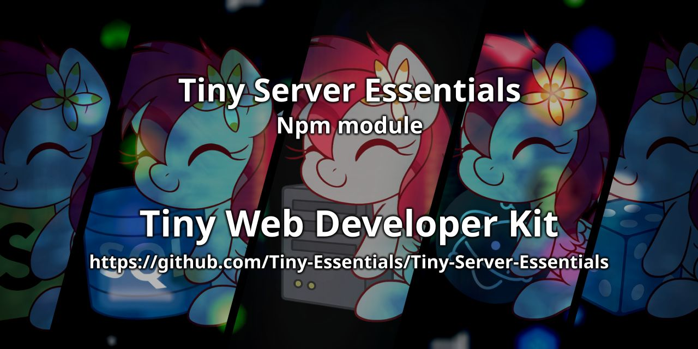

<div align="center">

<p>
    <a href="https://discord.gg/TgHdvJd"></a>
    <a href="https://www.npmjs.com/package/tiny-server-essentials"></a>
    <a href="https://www.npmjs.com/package/tiny-server-essentials"></a>
</p>
<p>
    <a href="https://www.patreon.com/JasminDreasond"></a>
    <a href="https://ko-fi.com/jasmindreasond"></a>
    <a href="https://chain.so/address/BTC/bc1qnk7upe44xrsll2tjhy5msg32zpnqxvyysyje2g"></a>
    <a href="https://chain.so/address/LTC/ltc1qchk520v4u8334n5dntmgeja55gc5g5rrkgpd4f"></a>
</p>
<p>
    <a href="https://nodei.co/npm/tiny-server-essentials/"></a>
</p>
</div>

# 🌐 Tiny Server Essentials

**A modular and strict toolkit for building scalable Express v5 + Socket.IO v4 apps with ease.**

---

## 🧠 What is this?

This project is a **collection of reusable server-side modules** designed to simplify and improve how you build modern real-time applications using:

* ✅ **Express v5** (modern middleware chaining)
* 🔄 **Socket.IO v4** (reliable WebSocket communication)
* 🧩 **Strict helpers** and **validation tools** to interconnect both layers with minimal effort

Instead of creating everything from scratch, this toolkit provides **well-structured classes and utilities** that speed up development while promoting clarity and separation of concerns.

---

## 🚀 What can it do?

With this toolkit, you can:

* ⚙️ Manage a single unified HTTP(S) server for both REST and WebSockets
* 🌍 Register and validate domain names for secure multi-tenant setups
* 🧾 Normalize, extract and match IP addresses with fallback strategies
* 📡 Simplify bi-directional communication logic using Socket.IO over a clean `TinyIo` wrapper
* 🧪 See it all in action with fully working examples

---

## Build 📦

To get started, please install the project dependencies. It is **mandatory** to run the build command afterward to ensure the module works correctly:
```bash
npm install
npm run build:essentials
```

## 🗂️ Where is everything?

You can find detailed documentation about each module in the [docs overview](./docs), where all core components like Express, Instance, Io, and Utils are explained clearly.

Also see [`/docs/client`](./docs/client) for browser-related features like 🎙️ mic volume filters!

---

## 🧪 Test It Yourself!

Looking for real use cases? Check out the [`test/servers`](./test/servers) folder for **simple and working examples** of how to:

* 🧵 Combine Express and Socket.IO on the same port
* 🧩 Integrate all modules for production-style setups
* 🔁 Test domain validation, IP filters, and WebSocket events

Just clone, install, and run a test server to see the magic in action! ✨

---

## 🛠️ Tech Stack

* **Node.js** (18+ recommended)
* **Express v5**
* **Socket.IO v4**

---

## 🤝 Contributions

Feel free to fork, contribute, and create pull requests for improvements! Whether it's a bug fix or an additional feature, contributions are always welcome.

## 📝 License

This project is licensed under the GPL-3.0 License - see the [LICENSE](LICENSE) file for details.

---

## 💡 Credits

> 🧠 **Note**: This documentation was written by [ChatGPT](https://openai.com/chatgpt), an AI assistant developed by OpenAI, based on the project structure and descriptions provided by the repository author.  
> If you find any inaccuracies or need improvements, feel free to contribute or open an issue!

---

## 🔙 Back to Tiny Essentials

Did you like this module? It’s part of the **Tiny Essentials** collection — a set of minimal yet powerful tools to make development easier.
👉 [Click here to explore more Tiny Essentials modules](https://github.com/Tiny-Essentials/Tiny-Essentials)

---

<div align="center">
<a href="./md-assets/img/"></a>
<br/>
Made with tiny love!
</div>